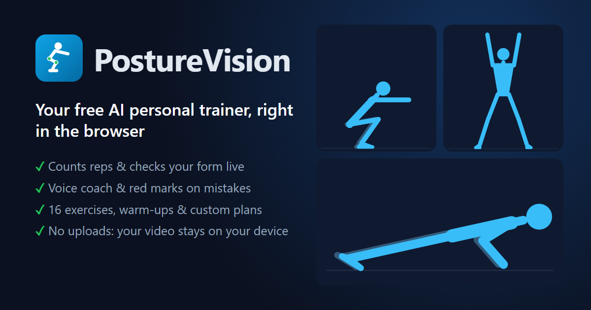
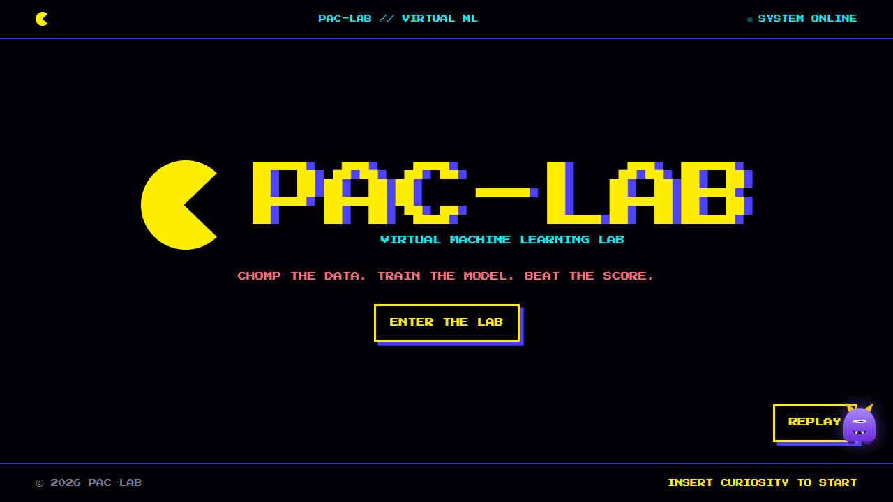
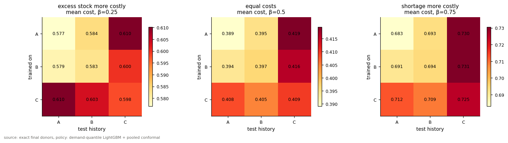
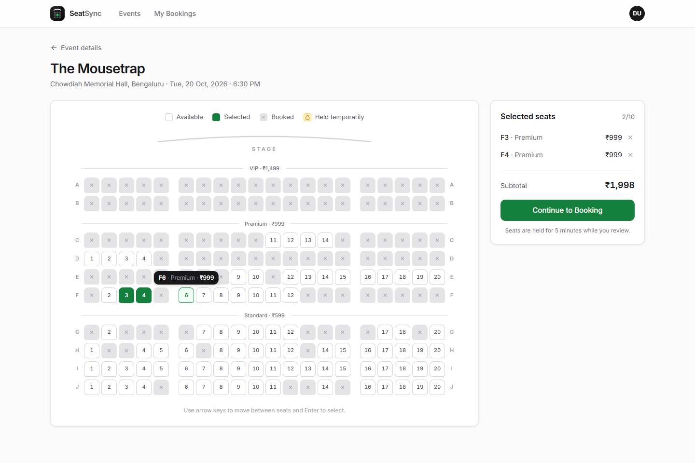
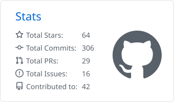
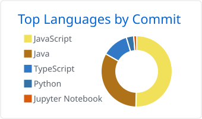

# Hi, I'm Akshara Kumari 👋

**AI/ML · Agentic AI · Generative AI · System Design · Full Stack · Cloud · Big Data**

I build machine-learning systems and the full-stack products that put them in people's hands, from research notebooks to deployed web apps.

---

## About Me

- 🎓 B.Tech in Computer Science and Engineering, specialising in **Big Data Analytics**
- 🧠 Interested in machine learning, LLMs, computer vision and the engineering needed to ship them
- 🔬 I like research-backed work: clear baselines, honest evaluation, reproducible notebooks
- 📈 Currently going deeper into advanced AI, cloud systems and software engineering

## 🚀 Currently Exploring

`Machine Learning & Deep Learning` · `LLMs & Agentic AI` · `Computer Vision` · `Full Stack Development` · `Cloud & DevOps` · `Research-oriented AI systems`

---

## 🔥 Featured Projects

<table>
  <tr>
    <td width="42%" valign="top">
      
    </td>
    <td valign="top">
      <h3><a href="https://github.com/aksharaagarwal21/PostureVision">PostureVision · AI Workout Coach in the Browser</a></h3>
      Counts your reps, checks your form and talks you through every set using just a webcam. The video never leaves your device.
        
      • MediaPipe Pose with 3D joint angles, One Euro smoothing and a calibrated rep counter that works from the front or the side 
      • Red marks on the joint that's wrong, a voice coach, and a k-NN classifier you can train on your own reps 
      • 16 exercises with warm-ups, custom plans with sets and rest timers, calorie estimates and workout history 
      • 150+ Vitest tests, deployed to GitHub Pages with GitHub Actions, installable on phones
        
      <code>React</code> <code>JavaScript</code> <code>MediaPipe</code> <code>Web Speech API</code> <code>Vitest</code> <code>GitHub Actions</code>
        
      <a href="https://aksharaagarwal21.github.io/PostureVision/"><b>Live demo</b></a> · <a href="https://github.com/aksharaagarwal21/PostureVision">Source</a>
    </td>
  </tr>
  <tr>
    <td width="42%" valign="top">
      
    </td>
    <td valign="top">
      <h3><a href="https://github.com/aksharaagarwal21/Pac-lab---Gamified-Virtual-Machine-Learning">PAC-LAB · Gamified Machine Learning Lab</a></h3>
      A virtual ML lab that teaches ten core algorithms through interactive simulations, quizzes and a Pac-Man-style level maze.
        
      • 10 experiments, from data pre-processing and regression to SVMs, random forests and a perceptron 
      • Student progress tracking, a faculty dashboard and in-browser Python 
      • Express + MySQL API, Playwright browser tests, deployed on Vercel
        
      <code>React</code> <code>JavaScript</code> <code>Express</code> <code>MySQL</code> <code>Playwright</code>
        
      <a href="https://pac-lab-steel.vercel.app/"><b>Live demo</b></a> · <a href="https://github.com/aksharaagarwal21/Pac-lab---Gamified-Virtual-Machine-Learning">Source</a>
    </td>
  </tr>
  <tr>
    <td width="42%" valign="top">
      
    </td>
    <td valign="top">
      <h3><a href="https://github.com/aksharaagarwal21/stockout-aware-demand-forecasting">Stockout-Aware Demand Forecasting</a></h3>
      Research on recovering latent retail demand when stockouts cut observed sales short, evaluated on FreshRetailNet-50K (~4.5M rows).
        
      • Three simulated stockout mechanisms, leakage checks and a protocol locked before final scoring 
      • Demand-quantile LightGBM with pooled conformal calibration, compared against TimesNet, TFT and Kaplan–Meier baselines 
      • 12.2%–21.4% lower mean <i>simulated</i> newsvendor cost than a seasonal-naive baseline
        
      <code>Python</code> <code>LightGBM</code> <code>PyTorch</code> <code>pandas</code> <code>DuckDB</code> <code>Jupyter</code>
        
      <a href="https://github.com/aksharaagarwal21/stockout-aware-demand-forecasting"><b>Notebook & results</b></a>
    </td>
  </tr>
  <tr>
    <td width="42%" valign="top">
      
    </td>
    <td valign="top">
      <h3><a href="https://github.com/aksharaagarwal21/SeatSync">SeatSync · Concurrent Ticket Booking</a></h3>
      An event booking platform built around one guarantee: two people can never book the same seat.
        
      • Optimistic (<code>@Version</code>) and pessimistic (<code>SELECT … FOR UPDATE</code>) locking, backed by database constraints 
      • Tested with 100 concurrent requests for one seat: exactly one succeeds 
      • Live seat map over SSE, emailed two-step verification, Docker, CI and a 500-user JMeter plan
        
      <code>Java</code> <code>Spring Boot</code> <code>PostgreSQL</code> <code>React</code> <code>TypeScript</code> <code>Docker</code>
        
      <a href="https://github.com/aksharaagarwal21/SeatSync"><b>Source & docs</b></a>
    </td>
  </tr>
</table>

| Project | What it does | Stack | Links |
|---|---|---|---|
| **Bloodwing** | Mental health care platform with role-based dashboards and an AI companion using retrieval-augmented Llama 3, crisis detection and moderation | React · FastAPI · MongoDB · Groq | [Live](https://bloodwing-mentalcare.vercel.app/) · [Source](https://github.com/aksharaagarwal21/Mental-Health-Care-Web) |
| **Face Mask Detection** | Real-time mask-compliance monitoring: 3-class CNN, face tracking, alerts and an analytics dashboard | TensorFlow · OpenCV · Flask | [Source](https://github.com/aksharaagarwal21/Face-mask-detection) |
| **University ERP System** | Student and faculty portals for attendance, marks, timetables and fees, on a SQL schema with views, triggers and transactions | React · Express · MySQL | [Source](https://github.com/aksharaagarwal21/University_erp_System) |

**Also building:** [DeepScholarAI](https://github.com/aksharaagarwal21/DeepScholarAI), an AI research assistant I'm developing phase by phase, from LLM foundations to agentic retrieval.

---

## 🧠 Tech Stack

| | |
|---|---|
| **Languages** |  &nbsp;SQL |
| **AI / ML** |  &nbsp;pandas · NumPy · LightGBM · LangChain |
| **Frontend** |  |
| **Backend** |  &nbsp;REST APIs |
| **Data** |  |
| **DevOps** |  |

---

## 📊 GitHub Activity

  <picture>
    <source media="(prefers-color-scheme: dark)" srcset="profile-summary-card-output/github_dark/3-stats.svg" />
    
  </picture>
  <picture>
    <source media="(prefers-color-scheme: dark)" srcset="profile-summary-card-output/github_dark/2-most-commit-language.svg" />
    
  </picture>

<picture>
  <source media="(prefers-color-scheme: dark)" srcset="https://raw.githubusercontent.com/aksharaagarwal21/aksharaagarwal21/output/github-snake-dark.svg" />
  
</picture>

---

## 📫 Connect With Me

<!-- Uncomment and fill in when ready:

-->
