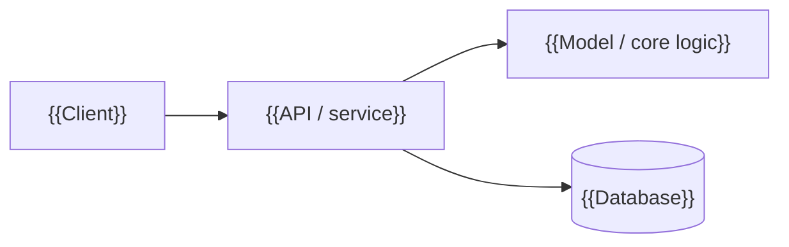

<!--
Project README template. Copy into a repository and replace every {{PLACEHOLDER}}.
Rules: show before you tell (screenshot or GIF first), keep paragraphs short,
never state a metric you can't point to in the code or results, delete sections that don't apply.
-->


# {{PROJECT_NAME}}

{{ONE_SENTENCE: what it is and who it is for.}}


**[Live demo]({{DEMO_URL}})** · **[Source]({{REPO_URL}})** · **[Docs]({{DOCS_URL}})**


## Overview

{{Two or three sentences: what the project does, and the one thing that makes it worth a look.}}

## Problem

{{Who has the problem, and why the obvious approach falls short. One short paragraph.}}

## Solution

{{How this project solves it. Name the key technique (e.g. "optimistic locking", "conformal calibration").}}

## Key Features

- **{{Feature}}**: {{what it does, in one line}}
- **{{Feature}}**: {{…}}
- **{{Feature}}**: {{…}}

## Architecture



{{One or two sentences on the important design decision.}}

## Tech Stack

| Layer | Technology |
|---|---|
| {{Frontend}} | {{…}} |
| {{Backend}} | {{…}} |
| {{ML / Data}} | {{…}} |
| {{Infrastructure}} | {{…}} |

## Installation

```bash
git clone {{REPO_URL}}.git
cd {{REPO_DIR}}
{{install command}}
```

Configuration: copy `.env.example` to `.env` and set {{VARIABLES}}. Never commit `.env`.

## Usage

```bash
{{run command}}
```

{{Where to open it, a demo login if there is one, and the first thing to try.}}

## Screenshots

| {{Screen}} | {{Screen}} |
|---|---|
|  |  |

## Results / Metrics

| Metric | Value | How it was measured |
|---|---|---|
| {{metric}} | {{value}} | {{dataset, split, baseline, hardware}} |

{{Only real, reproducible numbers. State the limitations next to them.}}

## Project Structure

```
{{repo}}/
├── {{src/}}        {{what lives here}}
├── {{tests/}}      {{…}}
└── {{docs/}}       {{…}}
```

## Future Improvements

- {{Next concrete step}}
- {{…}}

## Contributors

- **Akshara Kumari** · [@aksharaagarwal21](https://github.com/aksharaagarwal21)

## License

{{LICENSE}}. See [LICENSE](LICENSE).
